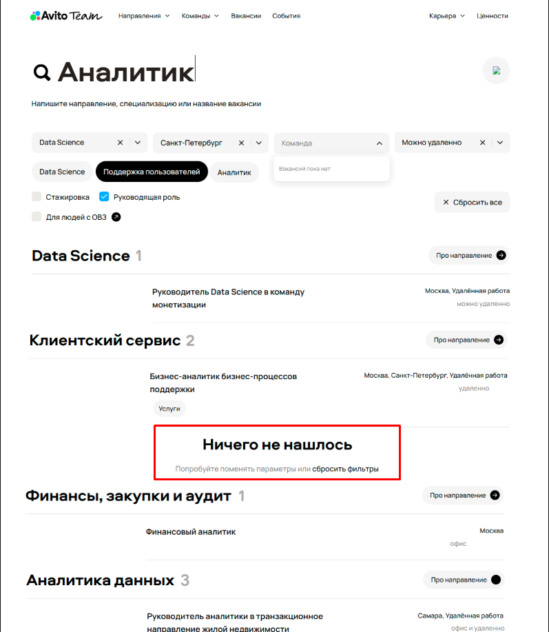
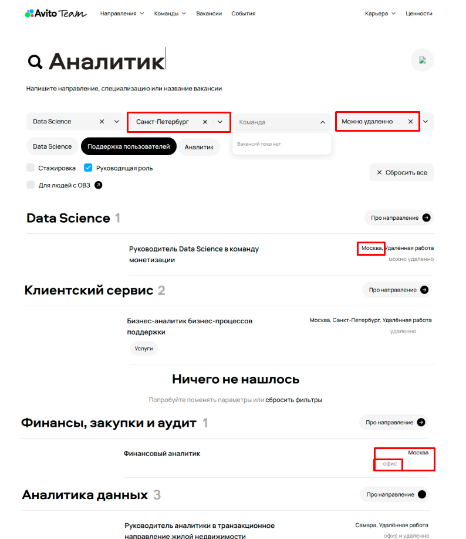
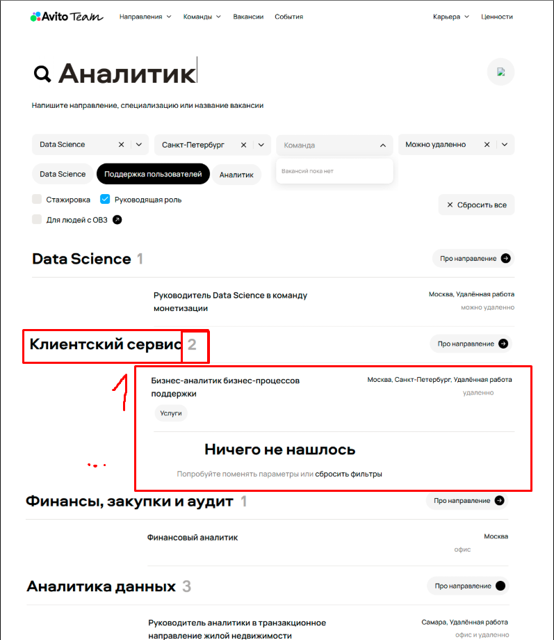
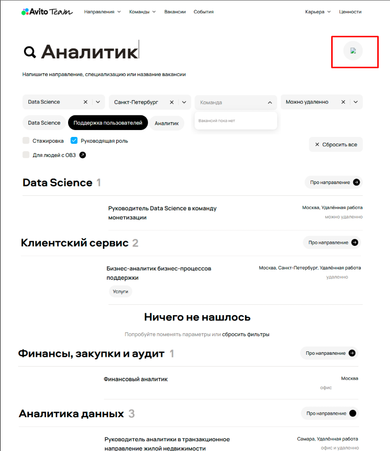
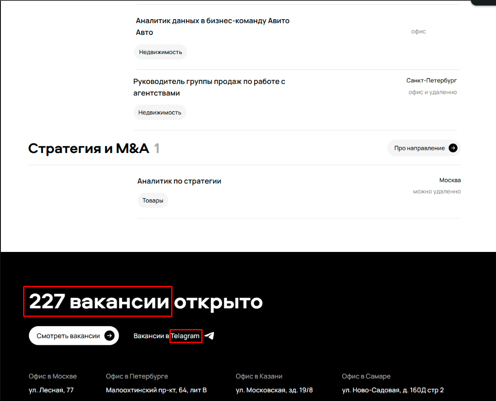
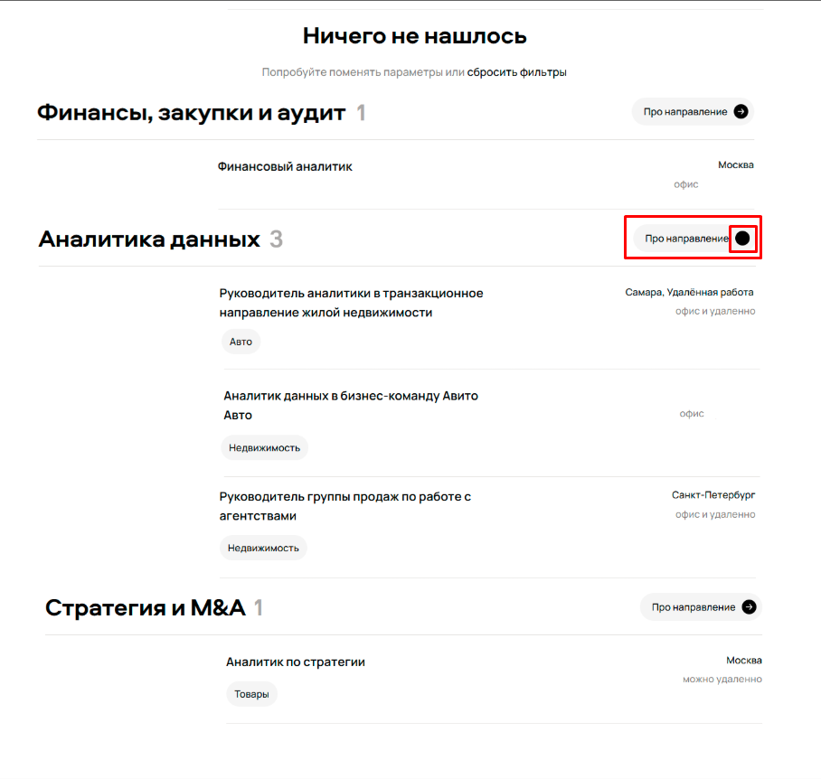
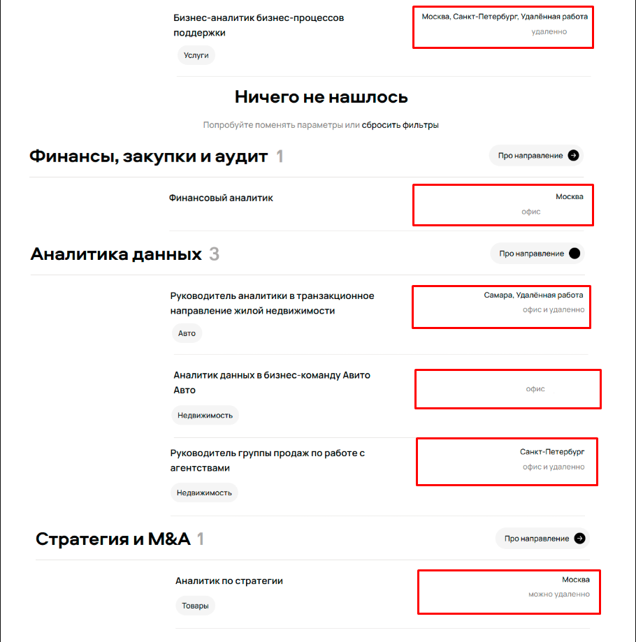
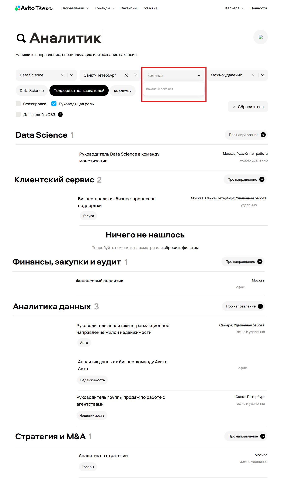
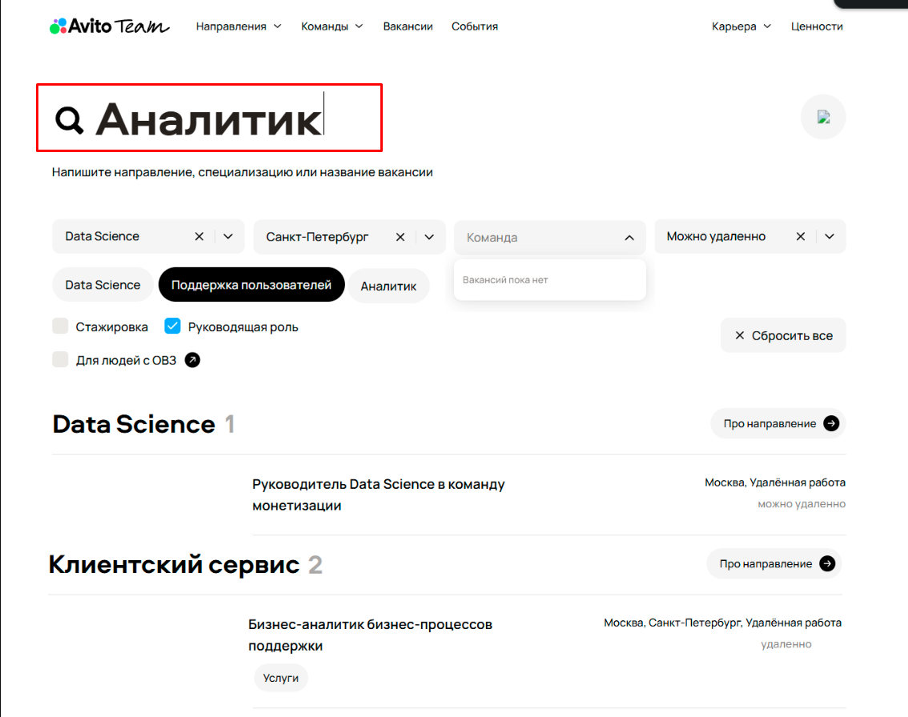

# BUGS_FROM_SCREENSHOT.md

## Обнаруженные баги на карьерном сайте Авито

### 1. Противоречивое сообщение об отсутствии результатов
**Приоритет:** High  
**Описание:**  
Сообщение "Ничего не нашлось" отображается именно в разделе "Клиентский сервис 2", при этом в этом же разделе отображаются результаты поиска (вакансия "Бизнес-аналитик бизнес-процессов поддержки").  
**Ожидаемое поведение:**  
Сообщение "Ничего не нашлось" должно появляться только когда результаты поиска отсутствуют в данном разделе.  
**Фактическое поведение:**  
Сообщение отображается в разделе "Клиентский сервис 2", несмотря на наличие вакансии в этом разделе.  
**Скриншот:**  
  
**Обоснование приоритета:**  
Критическая ошибка, нарушающая основную функциональность поиска. Пользователь не может определить, является ли поиск успешным, что приводит к потере доверия к сервису. Соответствует категории "High Priority and High Severity" в ISTQB.

### 2. Некорректная работа фильтрации
**Приоритет:** High  
**Описание:**  
Фильтрация работает некорректно по всем критериям, включая город (Санкт-Петербург), при этом отображаются вакансии из Москвы, Самары и других городов. Также фильтр "Команда" показывает сообщение "Вакансий пока нет" при наличии результатов поиска.  
**Ожидаемое поведение:**  
Результаты поиска должны соответствовать всем примененным фильтрам, включая фильтр "Команда".  
**Фактическое поведение:**  
Фильтры не ограничивают результаты поиска, показывая вакансии, не соответствующие выбранным критериям. Фильтр "Команда" показывает "Вакансий пока нет" при наличии результатов.  
**Скриншот:**  
  
**Обоснование приоритета:**  
Основная функция фильтрации не работает, что делает её бесполезной для пользователей. Критическая ошибка для поисковой системы, влияющая на основную функциональность. Соответствует "High Priority and High Severity".

### 3. Несоответствие количества вакансий в заголовке раздела
**Приоритет:** Medium  
**Описание:**  
В разделе "Клиентский сервис 2" отображается только одна вакансия, несмотря на указание числа "2" в заголовке.  
**Ожидаемое поведение:**  
Число в заголовке раздела должно соответствовать количеству отображаемых вакансий.  
**Фактическое поведение:**  
Количество вакансий не соответствует числу в заголовке.  
**Скриншот:**  
  
**Обоснование приоритета:**  
Ошибка влияет на точность информации, но не блокирует основные функции. Соответствует категории "Medium Priority and Medium Severity", так как вводит пользователя в заблуждение относительно доступных вакансий.

### 4. Неполная загрузка изображения
**Приоритет:** Medium  
**Описание:**  
В правом верхнем углу вместо профиля отображается плейсхолдер непрогруженной картинки.  
**Ожидаемое поведение:**  
Должно отображаться изображение профиля или стандартный аватар.  
**Фактическое поведение:**  
Отображается стандартный браузерный плейсхолдер для непрогруженного изображения.  
**Скриншот:**  
  
**Обоснование приоритета:**  
Визуальный баг, влияющий на восприятие профессионализма сайта. Не блокирует основные функции, но может вызвать сомнения в надежности сервиса. Соответствует "Medium Priority and Medium Severity".

### 5. Орфографические ошибки в нижней части страницы
**Приоритет:** Low  
**Описание:**  
В нижней части страницы: "227 вакансии открыто" (некорректное склонение) и "Вакансии в Telagram" вместо "Telegram".  
**Ожидаемое поведение:**  
"227 вакансий открыто" и "Вакансии в Telegram".  
**Фактическое поведение:**  
Некорректное склонение и опечатка в названии Telegram.  
**Скриншот:**  
  
**Обоснование приоритета:**  
Косметическая ошибка, не влияющая на функциональность. Соответствует "Low Priority and Low Severity", так как является визуальным недочетом без влияния на пользовательский опыт.

### 6. Некорректное отображение иконки на кнопке "Про направление"
**Приоритет:** Low  
**Описание:**  
Иконка-стрелка на кнопке "Про направление" отображается некорректно (разная для разных разделов).  
**Ожидаемое поведение:**  
Единый стиль иконок для всех кнопок "Про направление".  
**Фактическое поведение:**  
Несоответствие в отображении иконок (стрелки и точки) для разных разделов.  
**Скриншот:**  
  
**Обоснование приоритета:**  
Косметический дефект, не влияющий на функциональность. Соответствует "Low Priority and Low Severity", так как не мешает выполнению задач пользователя.

### 7. Неоднородное отображение информации о городах
**Приоритет:** Medium  
**Описание:**  
К городам неоднородно приписывается "удаленная работа" - в некоторых местах указано "Москва, Удалённая работа", в других только "Москва", в разделе "Аналитика данных" для вакансии "Аналитик данных в бизнес-команду Авито" город вообще не указан.  
**Ожидаемое поведение:**  
Единый формат отображения информации о городах и удаленной работе для всех вакансий.  
Например:
Если работа полностью дистант — не указывать город, оставить просто «удаленная»
,a если гибрид или очная работа — писать город, а потом формат работы

**Фактическое поведение:**  
Неоднородное отображение информации о возможностях удаленной работы, а также информации о городе(в разделе "Аналитика данных", вакансия "Аналитик данных в бизнес-команду Авито Авто" город вообще не отображается).  
**Скриншот:**  
  
**Обоснование приоритета:**  
Несоответствие в отображении данных может запутать пользователя относительно условий работы. Влияет на качество информации, но не блокирует основные функции. Соответствует "Medium Priority and Medium Severity".

### 8. Некорректное состояние фильтра "Команда"
**Приоритет:** High 
**Описание:**  
В выпадающем меню фильтра "Команда" отображается сообщение "Вакансий пока нет", несмотря на то, что на странице отображаются результаты поиска, включая вакансии от различных команд.  
**Ожидаемое поведение:** 
Сообщение "Вакансий пока нет" должно отображаться только когда по выбранному фильтру действительно нет результатов.  
**Фактическое поведение:**  
Сообщение отображается при наличии соответствующих вакансий на странице.  
**Скриншот:**  
  
**Обоснование приоритета:**  
Критическая ошибка в работе фильтрации, которая нарушает основную функциональность поиска вакансий. Пользователь не может доверять состоянию фильтров, что делает их бесполезными. Соответствует категории "High Priority and High Severity" в ISTQB.

### 9. Некорректное состояние курсора в поисковом поле после выполнения поиска
**Приоритет:** Medium  
**Описание:** 
В поисковом поле с введенным запросом "Аналитик" отображается курсор, указывающий на состояние редактирования, несмотря на то, что поиск уже выполнен и результаты отображены.  
**Ожидаемое поведение:**  
После выполнения поиска курсор не должен отображаться в поисковом поле, так как ввод завершен.  
**Фактическое поведение:**  
Курсор остается видимым в поисковом поле после выполнения поиска.  
**Скриншот:**  
  
**Обоснование приоритета:**  
Это визуальный баг, который может запутать пользователя, создавая впечатление, что поиск еще не завершен или требуется дополнительный ввод. Хотя основная функциональность не нарушена, это ухудшает пользовательский опыт и противоречит стандартным паттернам поведения поисковых полей. Соответствует категории "Medium Priority and Medium Severity".